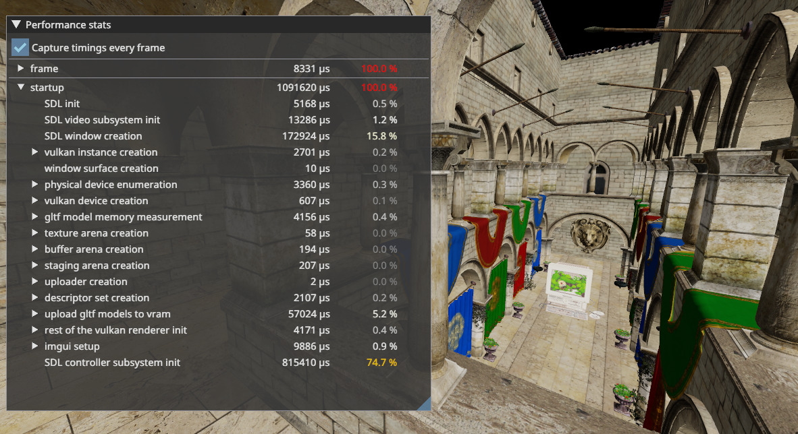
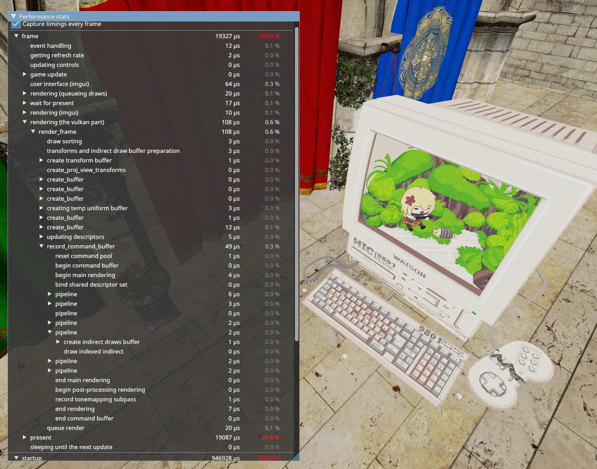
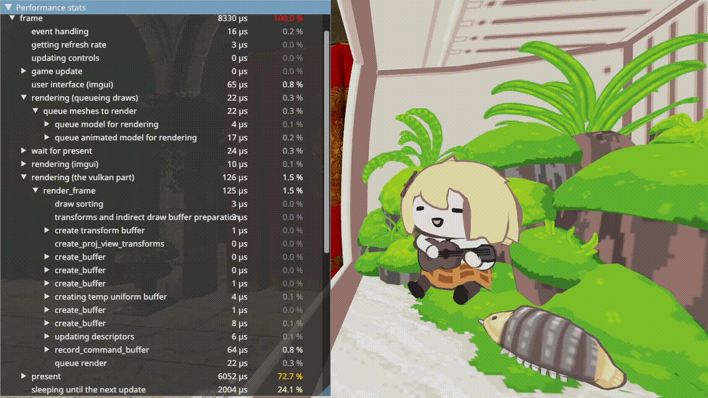

# Renderer II

This is my second renderer project, mainly developed between 2021–2023. It's a
3D renderer with a focus learning the Vulkan API and good performance. For a
longer overview, I've written [a blog
post](https://blog.neon.moe/2024/04/18/prelude.html) on this renderer, which
intended to turn into a series, but other duties came up.

## Credits

The sandbox binary uses some external assets created by other people.

The main scene is the classic Sponza, specifically the version from the
[glTF-Sample-Models][sponza] repository.

The animated computer-terrarium is [Smol Ame in an Upcycled Terrarium][smol-ame]
by [Seafoam][seafoam], with shape keys removed and meshes triangulated by me,
for compatibility with the renderer (Blender glTF export does not export
tangents for non-triangulated meshes, and meshes with shape keys can't be
triangulated — not that the renderer supports them either). The original model
is licensed CC-BY 4.0.

## Building

### Prerequisites

- Rust and Cargo
- SDL2 development libraries
- Vulkan SDK (or `libvulkan-dev` or similar on linux)

### Building

```sh
cargo build --release
```

This will result in an executable named "sandbox" in
[target/release/](target/release/).

### Shader compilation

Note that compiled SPIR-V versions of the shaders are included in the
repository, so you don't need a glsl-to-spirv toolchain just to build the
library. If you edit the GLSL shader files in `shaders/glsl`, the build script
will try to build them into SPIR-V using `glslc`, in which case you'll need
[shaderc][shaderc] to be installed to build the library.

## The sandbox example

The sandbox example features a first-person flying camera, controllable by
clicking on the window to bind the mouse (Esc to release the mouse) to look
around and WASD to move, or with a controller's analog sticks. The camera can
also be moved up and down with Q and X, or with the triggers of a controller.

The renderer can render various material and surface properties rather than the
trivial "lighting" it does by default. The default "lit" renderer doesn't
actually make use of anything except the base color and normals. Here's the
table of keybinds to rendering modes:

| Key | Visualization mode |
|-----|--------------------|
| 1   | Base color ("albedo") |
| 2   | "Draw id," shows separate draw calls with separate colors |
| 3   | Normals |
| 4   | Roughness and metallic, in the green and blue channels respectively |
| 5   | Emissive color |
| 6   | Ambient occlusion |
| 0   | The default, "lit" |

If the `profile-with-tracing` feature is enabled (it is by default), there will
be a collapsed imgui window called "Performance stats" which can be expanded to
view the live timings of various procedures in the renderer. The first section
describes the latest finished frame, and the second one describes the startup
procedure before the main loop was entered.

### Highlights

The engine starts up pretty quickly: the entire startup takes about a second on
my Linux desktop, but roughly 90% of it is spent in platform-specific SDL
procedures — that's just 100 milliseconds to load all the models and textures
and build the pipelines and so on!



The rendering part is pretty fast too, ~20 microseconds to queue up the meshes
to render (includes calculating the bone transforms) and ~100 microseconds for
all the Vulkan calls on my Linux desktop. That mostly reflects the fact that not
much is happening, but there was some effort during development to avoid
unnecessary allocations and keep memory accesses cache-friendly.

There are a few ways the renderer avoids having to call Vulkan too much: it uses
indirect rendering, so all of the draw commands are prepared into a single
buffer, which is sent to the GPU for rendering. Also, textures and material data
are stored in arrays, indexed into with `gl_BaseInstanceARB`, so different
materials do require separate (indirect!) draw calls, but the descriptors can be
bound just once.



The most visually impressive feature of the renderer is probably the skeletal
animation — the model and animations themselves are from Sketchfab, credit to
[Seafoam][seafoam]! Fancy rendering effects weren't really the focus of this
project, alas, no cool PBR lighting. Shadow maps were on the TODO list, but I
just never got to it.



[sponza]: https://github.com/KhronosGroup/glTF-Sample-Models/tree/master/2.0/Sponza
[smol-ame]: https://sketchfab.com/3d-models/smol-ame-in-an-upcycled-terrarium-hololiveen-490cecc249d242188fda5ad3160a4b24
[seafoam]: https://sketchfab.com/seafoam
[shaderc]: https://github.com/google/shaderc
